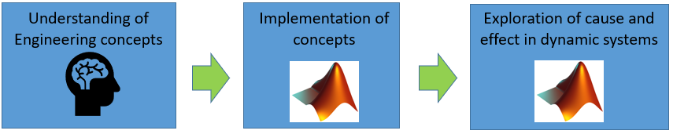

# Slider Crank **Kinematics** and **Kinetics** - a case study in ***Computational Thinking*** 

    

In this demo we explore both the **Kinematics** AND **Kinetics** of a slider crank mechanism.  We start a with velocity analysis (**kinematics**) of the mechanism, and use a MATLAB Live script to capture our workflow(eg: inserting relevant diagrams) and computations. We then compare our kinematic computations to those produced by a Simulink+Simscape model - the Simulink model also displays a CAD like visualization that animates as the mechanism moves.

In the 2nd part of this demo we perform a Force analysis(**kinetics**) by applying Newton's  law.  We again use a MATLAB Live script to capture our workflow, eg: inserting Free Body diagrams.  The Symbolic math toolbox is used to manage the equation manipulations - in fact the derivation results in a system of 8 equations with 8 unknowns.  This BRAIN derived model (non-linear ODEs) is then numerically solved in  Simulink.  The BRAIN model's response is also compared against the response of a corresponding Simscape model

  
# Owner

`Bradley Horton (bhorton@mathworks.com)`

  
# Concepts

Some key concepts that are demonstrated include:

Specifically we'll look at how:

   1.  **Symbolic computing** can support and enhance the 1st principles  derivation of the system equations of motion. 
   1.  After deriving the equations of motion, you can then explore "cause and effect" by Simulating the dynamic systems in **Simulink**. 

  
# Suggested Audience

CSEs, undergraduate students, professors, mechanical engineering, mechatronic engineering

  
# Workflow

Open and read the file **`DEMO_START_HERE_PLEASE.mlx`** this gives an overview of the 3 design tasks performed by the DEMO.   Each design task is contained in a seperate MATLAB Live script.  The 3 design tasks(DEMOS) are:  

  
## DEMO_01:    Kinematic analysis and simulation

   -  Open the Live script file [**`bh_DEMO_01_kinematics_analysis_SLIDER_CRANK.mlx`**]. 
   -  In this script we perform a velocity analysis of the mechanism. 
   -  We then compare the results of the velocity analysis against the results produced by a Simulink model. 
   -  The Simulink model also shows a CAD like animation of the mechanism's motion 

  
## DEMO_02:    *Kinetic* analysis - derive Equations of Motion

   -  Open the Live script file [**`bh_DEMO_02_dynamics_derivation_SLIDER_CRANK.mlx`**]. 
   -  In this script we apply Newton's  law and derive the Equations of motion for the mechanism 
   -  When you run the script it automatically creates a MATLAB function block that contains these dynamics. 

  
## DEMO_03:    *Kinetic* analysis - Numerically solve the dynamics (Simulate)

   -  Open the Live script file [**`bh_DEMO_03_dynamics_simulation_SLIDER_CRANK.mlx`**]. 
   -  In this script we load numeric model parameters into the MATLAb workspace(eg: link lengths amd Inertias) 
   -  A Simulink model is opened, and numerically solves the derived equations of motion. 
   -  The BRAIN derived model response is compared against teh reponse produced by a Simscape model. 

  
# TODO

N/A

  
# Release that demo was last tested in

R2022a, R2022b

  
# System Requirements

The Demo has the following product dependencies:

   1.  MATLAB 
   1.  Symbolic Math Toolbox 
   1.  SIMULINK 
   1.  Simscape 
   1.  Simscape Multibody 

  
# Revision History

First draft 12-Jul-2022

