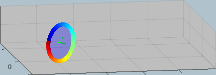

# A thin rolling wheel(NO slip) 

In this demo we derive the **DYNAMIC equations of motion** of a **thin rolling wheel assuming the "NO slip"** condition at the ground contact point. We'll derive these equations of motion using 2 different techniques:

   -  A Newtonian approach 
   -  A Lagrangian approach using nonholonomic constraints 

We'll then compare the results of these 2 models by performing a simulation of the derived dynamics with Simulink.

## Owner

Bradley Horton (bhorton@mathworks.com)

# How does MATLAB enhance the learning and understanding of concepts?

The following infographic summarises the intentions of this case study:

Specifically we'll look at how:

   1.  **Symbolic computing** can support and enhance the 1st principles  derivation of the system equations of motion. 
   1.  After deriving the equations of motion, you can then explore "cause and effect" by Simulating the dynamic systems in **Simulink**. 

# Suggested Audience
CSEs, undergraduate students, professors, mechanical engineering, physics

# Workflow

## DEMO_01:    Equations of motion via **Newton**

   -  Open the Live script file [**`bh_DEMO_01_rolling_wheel_Newton.mlx`**]
   -  In this script we derive the Equations of motion for the rolling wheel using **Newton's 2nd Law** 
   -  When you run the script it automatically creates a MATLAB function block that contains these dynamics. 

*NOTE:  you don't need to do anything with this block as a VERSION of it has been inserted into a Simulink model already.*

## DEMO_02:    Equations of motion via Lagrange

   -  Open the Live script file [**`bh_DEMO_02_rolling_wheel_Lagrangian.mlx`**]
   -  In this script we derive the Equations of motion for the rolling wheel using **Lagrange's technique.** 
   -  When you run the script it automatically creates a MATLAB function block that contains these dynamics. 

*NOTE:  you don't need to do anything with this block as a VERSION of it has been inserted into a Simulink model already.*

## DEMO_03:    Simulating the Rolling wheel in Simulink

   -  Open the the Live script file [**`bh_DEMO_03_rolling_wheel_Simulation.mlx`**]
   -  When you run the script it loads some parameters into the base workspace 
   -  It also opens the Simulink model  **bh_rolling_wheel_sim.slx** 
   -  Observe the animation of the wheel as the dynamics are solved 
   -  We compare the Newtonian simulation results with the Lagrangian simulation results 

## DEMO_04:    Simulating the Rolling wheel in Simscape

   -  Open the the Live script file [**`bh_DEMO_04_rolling_wheel_Simulation_Simscape.mlx`**]
   -  When you run the script it loads some parameters into the base workspace 
   -  It also opens the Simulink model  **bh_rolling_wheel_sim_simscape.slx** 
   -  Observe the animation of the wheel as the dynamics are solved 
   -  We compare the Newtonian simulation results with the Simscape simulation results 

# System Requirements

These demos have been developed and tested in **R2021a** and  **R2020b** and **R2022b** MATLAB release.

The Demo has the following product dependencies:

   1.  MATLAB 
   1.  Symbolic Math Toolbox 
   1.  SIMULINK
   1.  Simscape multibody
 

 **ATTENTION**:   A supported C-compiler is also required [https://www.mathworks.com/support/requirements/supported-compilers.html](https://www.mathworks.com/support/requirements/supported-compilers.html) *NOTE:  the FREE compilers that are listed*

